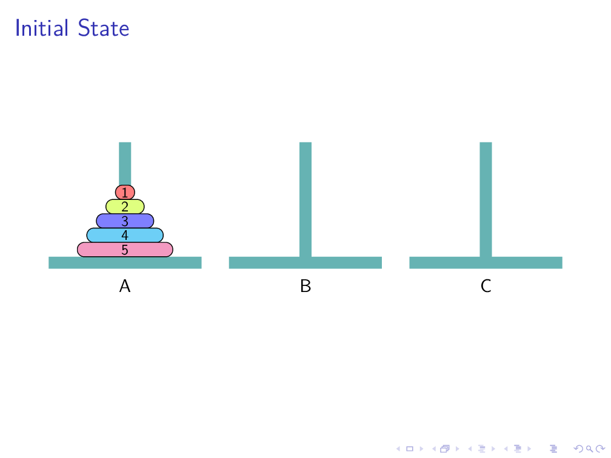

# latex3-hanoi
Use LaTeX3 to solve the Tower of Hanoi problem

---

使用[LaTeX3编程接口](https://zhuanlan.zhihu.com/p/408331900)解决`汉诺塔问题`，并使用`beamer`宏包生成`演示文档`（详见[hanoi.tex](./hanoi.tex)）

将该文档播放幻灯片可以得到如下动画：

[可由此下载hanoi.pdf](./hanoi.pdf)